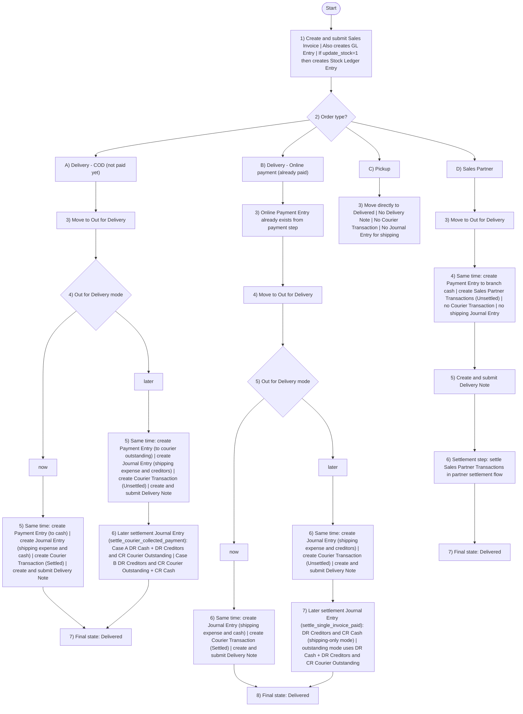

# Accounting Flow (Simple) — COD vs Online + Pickup + Partners

## Main Diagram

## Written Summary

### A) Delivery - COD
1. Invoice is created (customer still owes money).
2. At Out for Delivery, choose mode:
    - now: immediate settlement path.
    - later: deferred settlement path.
3. COD now path creates together:
    - Payment Entry (to cash).
    - Journal Entry (shipping expense and cash).
    - Courier Transaction (Settled).
    - Delivery Note.
4. COD later path creates together:
    - Payment Entry (to courier outstanding).
    - Journal Entry (shipping expense and creditors).
    - Courier Transaction (Unsettled).
    - Delivery Note.
5. Settlement step exists only in later branch: `settle_courier_collected_payment` creates a settlement Journal Entry with these account outputs:
    - Case A: DR Cash + DR Creditors and CR Courier Outstanding.
    - Case B: DR Creditors and CR Courier Outstanding + CR Cash.
   Then Courier Transaction becomes Settled.

### B) Delivery - Online Payment
1. Invoice is already paid at order time.
2. At Out for Delivery, choose mode:
    - now: immediate settlement path.
    - later: deferred settlement path.
3. Online now path creates together:
    - Journal Entry (shipping expense and cash).
    - Courier Transaction (Settled).
    - Delivery Note.
4. Online later path creates together:
    - Journal Entry (shipping expense and creditors).
    - Courier Transaction (Unsettled).
    - Delivery Note.
5. Settlement step exists only in later branch: `settle_single_invoice_paid` creates a settlement Journal Entry with these account outputs:
    - Shipping-only mode: DR Creditors and CR Cash.
    - Outstanding mode: DR Cash + DR Creditors and CR Courier Outstanding.
   Then Courier Transaction becomes Settled.

### C) Pickup
1. Order goes directly to Delivered.
2. No courier transaction, no shipping journal, and no delivery note in pickup path.

### D) Sales Partner
1. On Out for Delivery, system creates together:
    - Payment entry to branch cash.
    - Sales partner transaction (Unsettled).
2. No courier transaction and no shipping journal in this path.
3. Delivery note is created.
4. Settlement step is handled in the sales partner settlement flow.
5. Then order is Delivered.
