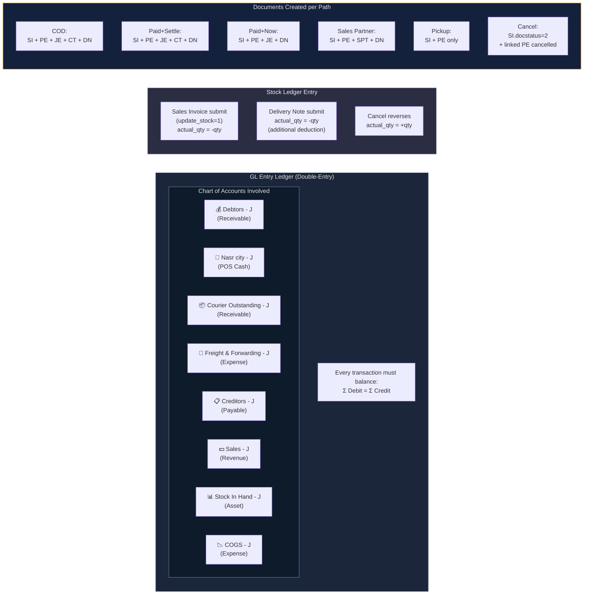

# Account & Document Reference Map

```mermaid
flowchart LR
    subgraph GL["GL Entry Ledger (Double-Entry)"]
        direction TB
        GL1["Every transaction must balance:\nΣ Debit = Σ Credit"]

        subgraph ACCOUNTS["Chart of Accounts Involved"]
            ACC1["💰 Debtors - J\n(Receivable)"]
            ACC2["🏪 Nasr city - J\n(POS Cash)"]
            ACC3["📦 Courier Outstanding - J\n(Receivable)"]
            ACC4["🚚 Freight & Forwarding - J\n(Expense)"]
            ACC5["📋 Creditors - J\n(Payable)"]
            ACC6["💵 Sales - J\n(Revenue)"]
            ACC7["📊 Stock In Hand - J\n(Asset)"]
            ACC8["📉 COGS - J\n(Expense)"]
        end
    end

    subgraph SLE["Stock Ledger Entry"]
        SLE1["Sales Invoice submit\n(update_stock=1)\nactual_qty = -qty"]
        SLE2["Delivery Note submit\nactual_qty = -qty\n(additional deduction)"]
        SLE3["Cancel reverses\nactual_qty = +qty"]
    end

    subgraph DOCS["Documents Created per Path"]
        D1["COD:\nSI + PE + JE + CT + DN"]
        D2["Paid+Settle:\nSI + PE + JE + CT + DN"]
        D3["Paid+Now:\nSI + PE + JE + DN"]
        D4["Sales Partner:\nSI + PE + SPT + DN"]
        D5["Pickup:\nSI + PE only"]
        D6["Cancel:\nSI.docstatus=2\n+ linked PE cancelled"]
    end

    style GL fill:#1b263b,stroke:#415a77,color:#e0e1dd
    style SLE fill:#2b2d42,stroke:#8d99ae,color:#edf2f4
    style DOCS fill:#14213d,stroke:#fca311,color:#e5e5e5
    style ACCOUNTS fill:#0d1b2a,stroke:#778da9,color:#e0e1dd
```
