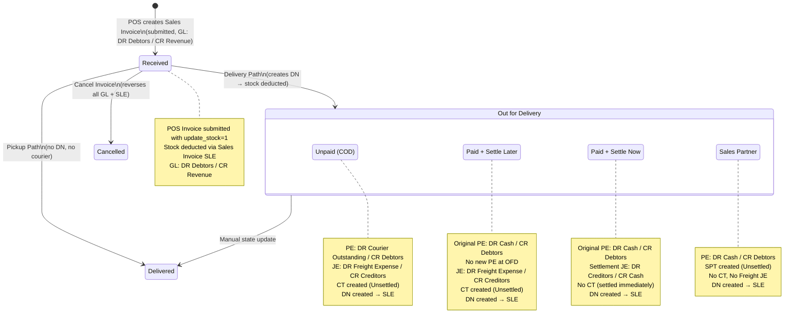

# POS Invoice Lifecycle — State Transitions

```mermaid
stateDiagram-v2
    direction TB

    [*] --> Received: POS creates Sales Invoice\n(submitted, GL: DR Debtors / CR Revenue)

    state "Received" as Received
    state "Out for Delivery" as OFD
    state "Delivered" as Delivered
    state "Cancelled" as Cancelled

    Received --> Delivered: Pickup Path\n(no DN, no courier)
    Received --> OFD: Delivery Path\n(creates DN → stock deducted)
    Received --> Cancelled: Cancel Invoice\n(reverses all GL + SLE)

    state OFD {
        direction LR
        state "Unpaid (COD)" as COD
        state "Paid + Settle Later" as PaidSettle
        state "Paid + Settle Now" as PaidNow
        state "Sales Partner" as SP
    }

    OFD --> Delivered: Manual state update

    note right of Received
        POS Invoice submitted with update_stock=1
        Stock deducted via Sales Invoice SLE
        GL: DR Debtors / CR Revenue
    end note

    note right of COD
        PE: DR Courier Outstanding / CR Debtors
        JE: DR Freight Expense / CR Creditors
        CT created (Unsettled)
        DN created → SLE
    end note

    note right of PaidSettle
        Original PE: DR Cash / CR Debtors
        No new PE at OFD
        JE: DR Freight Expense / CR Creditors
        CT created (Unsettled)
        DN created → SLE
    end note

    note right of PaidNow
        Original PE: DR Cash / CR Debtors
        Settlement JE: DR Creditors / CR Cash
        No CT (settled immediately)
        DN created → SLE
    end note

    note right of SP
        PE: DR Cash / CR Debtors
        SPT created (Unsettled)
        No CT, No Freight JE
        DN created → SLE
    end note
```
